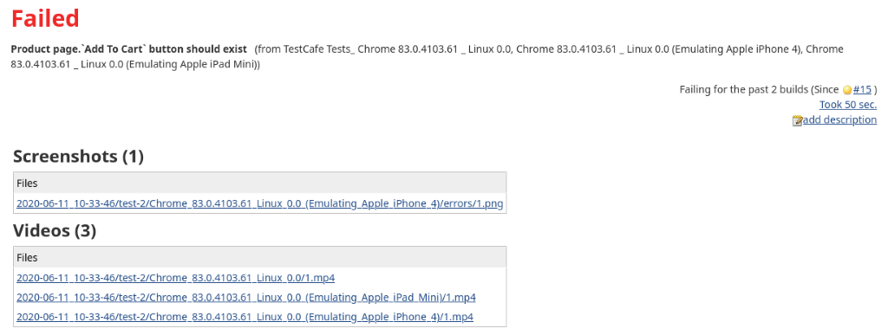
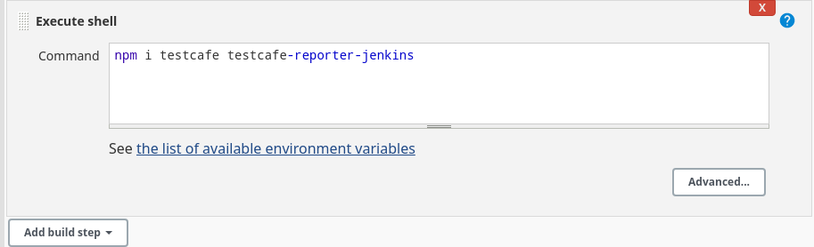
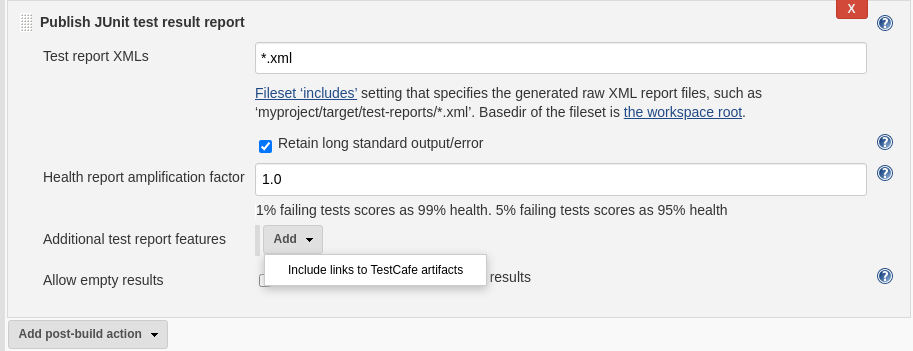

# Jenkins TestСafe Plugin

This plugin attaches TestCafe artifacts (screenshots and videos) to the Jenkins test results page.



## Usage

> See the following topic for information on how to configure Jenkins to run TestCafe:  [Integrate TestCafe with Jenkins](https://devexpress.github.io/testcafe/documentation/guides/continuous-integration/jenkins.html).

This plugin requires that you install and use the [TestCafe Jenkins reporter](https://www.npmjs.com/package/testcafe-reporter-jenkins):

```sh
npm i testcafe-reporter-jenkins
```

You can add `testcafe-reporter-jenkins` during the step that installs TestCafe:



In the command that runs TestCafe, use the [-r flag](https://devexpress.github.io/testcafe/documentation/reference/command-line-interface.html#-r-nameoutput---reporter-nameoutput) to specify the Jenkins reporter and the report file name:

```sh
testcafe chrome e2e/**/* -r jenkins:report.xml
```

### Use in Freestyle Jobs

Add the **Publish JUnit test result report** post-build action. In **Additional test report features**, click **Add** and select **Include links to TestCafe artifacts**:



Ensure that **Retain long standard output/error** is enabled so that Jenkins does not truncate the screenshot and video data.

### Use in Pipelines

In the [Jenkinsfile](https://www.jenkins.io/doc/book/pipeline/jenkinsfile/), add a [post-build step](https://www.jenkins.io/doc/book/pipeline/syntax/#post) that publishes the JUnit report:

```
post {
    always {
        junit keepLongStdio: true,
              testDataPublishers: [[$class: 'TestCafePublisher']],
              testResults: 'report.xml'
    }
}
```

> Notice that the `keepLongStdio` parameter must be set to `true`, otherwise the JUnit truncates the test output.

To see an example of how to run tests distributed among multiple agents in parallel, refer to the following GitHub repository: [Experiments with Jenkins](https://github.com/wentwrong/experiments-with-jenkins).

## Troubleshooting

**The video player is blank or the video does not start**

This issue can occur due to the [Content Security Policy](https://wiki.jenkins.io/display/JENKINS/Configuring+Content+Security+Policy) (CSP) in Jenkins. Check the browser console to see which policies are violated.

The most frequent reason is that media is not allowed to load in CSP. To resolve this issue, set the [media-src](https://developer.mozilla.org/en-US/docs/Web/HTTP/Headers/Content-Security-Policy/media-src) directive in the CSP header to `self`. Click **Manage Jenkins**, open the **Script Console**, and add the following line:

```java
System.setProperty("hudson.model.DirectoryBrowserSupport.CSP", "media-src 'self';")
```
